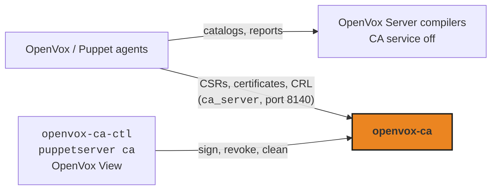
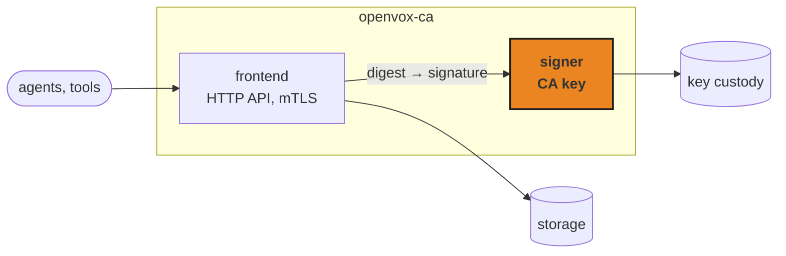
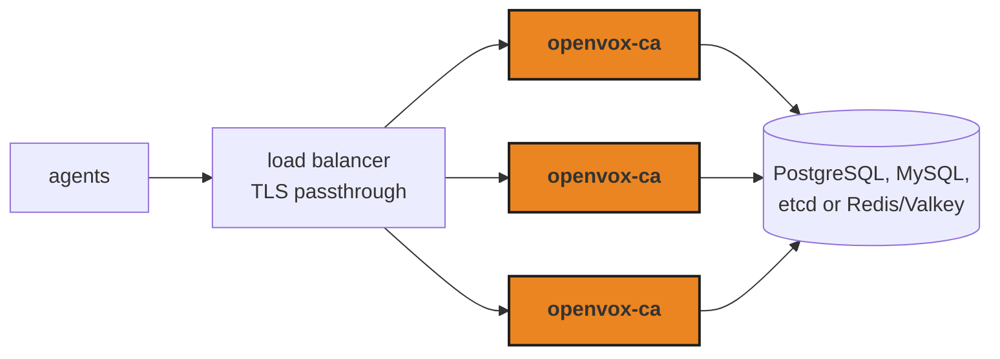
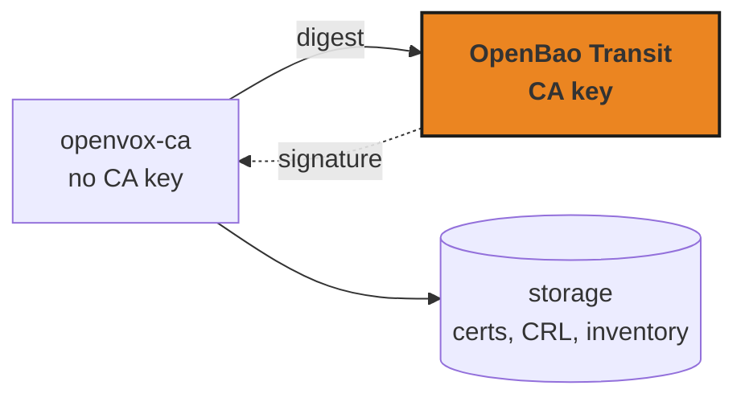

# Architecture and compatibility

<!-- Drop-in replacement story: minimal reconfiguration for existing deployments. -->

---

# Where it fits

<div class="-mt-2">



</div>

- The same layout as a scaled-out OpenVox install, with openvox-ca as the dedicated CA server ([betadots: Scaling Puppet Infrastructure](https://dev.to/betadots/scaling-puppet-infrastructure-3p2o))
- Separate CA server already? Agents need **no** changes. Single server today? Agents need `ca_server`

<!--
- Nothing new here architecturally: scaling OpenVox/Puppet beyond one server already means compilers with the CA service disabled (`certificate-authority-disabled-service` in `services.d/ca.cfg`) behind a load balancer, plus a single dedicated CA server. openvox-ca simply is that CA server.
- Reference: Martin Alfke (betadots), "Scaling Puppet Infrastructure", dev.to, February 2024.
- openvox-ca takes over every CA request on port 8140; catalogs, reports and PuppetDB are untouched.
- OpenVox Server and openvox-ca can't share a hostname and port, so the CA needs its own name or port. If you already run a separate CA server, openvox-ca takes over its hostname and port and agents don't notice. If you run a single OpenVox Server today, agents need `ca_server` (and `ca_port` if not 8140) in `puppet.conf`; that's a one-line change you can roll out with OpenVox itself before the cutover.
- Admin tooling: `openvox-ca-ctl` mirrors `puppetserver ca`; the HTTP API is the same one `puppetserver ca` and `puppet ssl` use. OpenVox View (the web dashboard) can also sign, revoke and clean through it.
Source: openvox-ca [`docs/migrating-from-puppet-server.md`](https://github.com/voxpupuli/openvox-ca/blob/main/docs/migrating-from-puppet-server.md) (steps 6-7, "Agent configuration").
-->

---

# Same wire, familiar disk

<div class="grid grid-cols-2 gap-12">
<div>

### On the wire

- The Puppet CA HTTP API: all 13 endpoints agents and OpenVox Server use
- Served at `/puppet-ca/v1/…`, as today
- Same defaults as a stock `auth.conf`: status is admin-only, CSR alt names off
- `openvox-ca-ctl` mirrors `puppetserver ca`
- Autosigning: the same `true`, allow-list and policy-executable modes

</div>
<div>

### On disk

| OpenVox Server | openvox-ca |
| --- | --- |
| `ca_crt.pem`, `ca_crl.pem` | same |
| `requests/`, `signed/` | same |
| `ca_key.pem` | `private/ca_key.pem` |
| `inventory.txt` | rebuilt on import |
| `serial` | not used |

</div>
</div>

<!--
**FIXME:** revisit once [voxpupuli/openvox-ca#397](https://github.com/voxpupuli/openvox-ca/issues/397) lands: the `ca_key.pem` and `inventory.txt` rows, and the title, should then say the directory is portable as-is.

- The `filesystem` backend is the default and uses a Puppet-style cadir: certificates, CSRs and the CRL are the same files in the same places. Two differences today: the CA key lives in `private/`, and the `inventory.txt` lines are formatted differently, so migration is `openvox-ca-ctl import` plus rebuilding `inventory.txt` from `signed/`. Making the directory portable in both directions without an import is planned: [voxpupuli/openvox-ca#397](https://github.com/voxpupuli/openvox-ca/issues/397).
- openvox-ca also adds a few files of its own (`.inventory.hmac`, `locks/`, `superseded.json`); OpenVox Server doesn't use them.
- Endpoints are served on both the bare path and `/puppet-ca/v1`, so it also works behind a prefix-stripping proxy.
- Authorisation defaults match OpenVox Server's shipped `auth.conf` (`certificate_status` is admin-only, via `pp_cli_auth` or the allow list) and `allow-subject-alt-names: false`.
- CLI mapping: `list`, `sign`, `revoke`, `clean`, `setup`, `import`, `generate` all have `openvox-ca-ctl` equivalents.
- **Autosigning**, compared with OpenVox Server's `certificate_authority.clj`:
  - Same: `false`/`true`/allow-list file/executable, chosen by the execute bit; the executable gets the certname as `argv[1]` and the CSR on stdin, exit 0 signs; the allow-list takes exact names, `*` and `*.domain` globs (any depth), ignores blank and `#` lines, and is re-read per CSR. SAN policy still applies to autosigned CSRs.
  - Extra: a 30 s timeout on the executable (OpenVox Server sets none); refuses a world-writable or foreign-owned executable at startup and logs its SHA-256; a sanitised environment; a warning for exit codes ≥ 126; wildcards anywhere in a pattern; works on any HA replica.
  - Gaps today: the executable doesn't get OpenVox Server's environment (`RUBYLIB`/`GEM_PATH`, secrets in env); its stdout/stderr isn't logged and ordinary rejections aren't either; `*.example.com` doesn't match bare `example.com` and globs are case-sensitive; a missing autosign file stops startup instead of meaning "off". The configuration lives in openvox-ca's own config (`autosign_config`), not `puppet.conf`, and defaults to off.

Sources: [README: Features](https://github.com/voxpupuli/openvox-ca/blob/main/README.md#features); [HTTP API reference](https://github.com/voxpupuli/openvox-ca/blob/main/docs/api.md); [Migration guide: directory layout mapping](https://github.com/voxpupuli/openvox-ca/blob/main/docs/migrating-from-puppet-server.md#directory-layout-mapping), [CLI command mapping](https://github.com/voxpupuli/openvox-ca/blob/main/docs/migrating-from-puppet-server.md#cli-command-mapping); [Storage backends: filesystem](https://github.com/voxpupuli/openvox-ca/blob/main/docs/storage-backends.md#filesystem-backend-default).
-->

---

# Inside openvox-ca



- The network-facing process never holds the CA key
- **Storage:** filesystem (drop-in), SQLite, PostgreSQL, MySQL, etcd, Redis
- **Key custody:** file, encrypted file, or OpenBao Transit
- One static Go binary with standard-library crypto; separate FIPS builds (BoringCrypto today)

<!--
- The default topology is three processes:
  - a **launcher**, which spawns the other two;
  - a **signer**, the only process that ever loads the CA key, with no network listener;
  - a **frontend**, which serves every request but never holds the key.
- The frontend sends digests to the signer over a pre-connected Unix socketpair and gets signatures back. The two ends first do a mutual challenge-response using a per-start pre-shared key.
- So a memory-disclosure bug in the HTTP layer can't leak the CA key: it isn't there. That holds in containers too: the published images and the Helm chart run the same three-process topology. `--single-process` collapses it into one and gives up the isolation; it's a debugging aid.
- Storage backends share one contract: CA cert and key, CRL, inventory, CSRs and issued certificates. `filesystem` is the default (a Puppet-style cadir); the HA backends come in the next section.
- Key custody: a plain file, a file encrypted at rest with AES-256-GCM, or an OpenBao Transit key that never leaves OpenBao.
- Crypto is `crypto/x509` and `net/http` from the standard library, with cgo off, so the normal build is a single static binary.
- FIPS at 1.0.0: separate `_fips` release tarballs for linux/amd64 and linux/arm64, built with `GOEXPERIMENT=boringcrypto`. BoringCrypto needs cgo, so these are dynamically linked. The release workflow checks every `_fips` artefact really is a BoringCrypto build. All storage backends work with it. No FIPS container image or deb/rpm package yet.
- Planned, not on the 1.0.0 milestone ([#329](https://github.com/voxpupuli/openvox-ca/issues/329)): move to Go's native FIPS 140-3 module, building with `GOFIPS140=certified` ([#330](https://github.com/voxpupuli/openvox-ca/issues/330)). No cgo, so the FIPS binary becomes static too, which makes a FIPS image ([#328](https://github.com/voxpupuli/openvox-ca/issues/328)) and `openvox-ca-fips` packages ([#333](https://github.com/voxpupuli/openvox-ca/issues/333)) cheap.
  - The Go Cryptographic Module holds CMVP certificate #5247 (FIPS 140-3, Level 1, active, sunset 2031-04-26); BoringCrypto's #4735 sunsets in 2029. Statuses as researched on 2026-09-11 ([#318](https://github.com/voxpupuli/openvox-ca/issues/318)): **check again before quoting**.
  - Wording: "uses a FIPS 140-3 validated cryptographic module", never "openvox-ca is FIPS certified". Only a `GOFIPS140=certified` build is covered by #5247; `GODEBUG=fips140=on` alone runs unvalidated code ([#331](https://github.com/voxpupuli/openvox-ca/issues/331)).
  - Outside the module either way: SHA-1 (required by RFC 5280/6960 for key identifiers and OCSP cert IDs) and Argon2id for the optional encrypted CA key ([#332](https://github.com/voxpupuli/openvox-ca/issues/332)).

Sources: [CA key security: process isolation](https://github.com/voxpupuli/openvox-ca/blob/main/docs/ca-key-security.md#process-isolation), [key encryption at rest](https://github.com/voxpupuli/openvox-ca/blob/main/docs/ca-key-security.md#ca-key-encryption-at-rest); [OpenBao Transit-engine CA key](https://github.com/voxpupuli/openvox-ca/blob/main/docs/openbao-transit.md); [Storage backends](https://github.com/voxpupuli/openvox-ca/blob/main/docs/storage-backends.md); [Storage internals: backend contract](https://github.com/voxpupuli/openvox-ca/blob/main/docs/development/storage-internals.md#backend-contract); [Building, including FIPS](https://github.com/voxpupuli/openvox-ca/blob/main/CONTRIBUTING.md#building).
-->

---

# Migrating in six steps

<div class="grid grid-cols-2 gap-12">
<div>

1. Back up the existing CA directory
2. `openvox-ca-ctl import` the CA cert, key and CRL
3. Copy signed certificates and rebuild the inventory
4. Disable the CA service in OpenVox Server (and set `ca_server` on agents, if it was a single server)
5. Start openvox-ca with its own TLS certificate
6. Run `puppet agent --test` and check

</div>
<div>

**Rollback:** restore the backup and switch the CA service back on.

The migration is tested against a CA created by a real OpenVox Server.

</div>
</div>

<!--
**FIXME:** replace this slide with the hidden "Migrating in four steps" slide that follows once [voxpupuli/openvox-ca#397](https://github.com/voxpupuli/openvox-ca/issues/397) lands: unhide that one (remove `hide: true`) and hide or delete this one.

- Needs a short maintenance window: no new signing while the CA moves.
- `openvox-ca-ctl import` takes the CA certificate as a full chain (nearest first) and an optional CRL chain. Only `X509 CRL` blocks are accepted, because the CRL is served to every agent.
- Step 3 exists because the inventory line format differs today ([voxpupuli/openvox-ca#397](https://github.com/voxpupuli/openvox-ca/issues/397)). Rebuilding from `signed/` loses OpenVox Server's history of revoked and expired entries.
- Step 4: a single OpenVox Server can't share its hostname and port with openvox-ca, so agents need `ca_server` (and `ca_port` if not 8140). Roll that out with OpenVox before the cutover.
- Step 5: `openvox-ca generate` mints the CA's own serving certificate offline, before the server starts.
- The migration suite (`test/compose-migration.yml`) starts `voxpupuli/puppetserver`, lets it create a genuine CA, imports it, and checks that old certificates fetch, new ones sign, and migrated ones revoke and clean. It doesn't test rollback.

Sources: [Migration guide](https://github.com/voxpupuli/openvox-ca/blob/main/docs/migrating-from-puppet-server.md), including [rollback](https://github.com/voxpupuli/openvox-ca/blob/main/docs/migrating-from-puppet-server.md#rollback); [Testing: `test:migration`](https://github.com/voxpupuli/openvox-ca/blob/main/docs/development/testing.md).
-->

---
hide: true
---

# Migrating in four steps

<div class="grid grid-cols-2 gap-12">
<div>

1. Back up the CA directory
2. Disable the CA service in OpenVox Server (and set `ca_server` on agents, if it was a single server)
3. Start openvox-ca on the **same** CA directory: no import
4. Run `puppet agent --test` and check

</div>
<div>

**Rollback:** stop openvox-ca and switch OpenVox Server's CA back on. Same directory, no changes.

**Coming back:** reset the inventory integrity file first.

</div>
</div>

<!--
**FIXME:** draft for after [voxpupuli/openvox-ca#397](https://github.com/voxpupuli/openvox-ca/issues/397) lands. Check the steps against the updated migration guide, then unhide this slide and retire "Migrating in six steps".

- openvox-ca reads and writes the OpenVox Server cadir as-is: CA key at `ca_key.pem`, and inventory lines in OpenVox Server's format.
- Step 3: point `cadir` at the existing directory (e.g. `/etc/puppetlabs/puppetserver/ca`), or copy it to the openvox-ca host.
- Rollback needs no changes to the directory. That's a hard requirement in #397, because it's the escape hatch.
- Coming back after OpenVox Server has signed or revoked anything: remove or rebuild `.inventory.hmac` first, because OpenVox Server appends to `inventory.txt` without updating it.

Source: [voxpupuli/openvox-ca#397](https://github.com/voxpupuli/openvox-ca/issues/397), "Acceptance criteria".
-->

---

# Deliberate differences

- **Random 128-bit serial numbers**, following CA/Browser Forum practice: unpredictable, not a counter. The old `serial` file is ignored
- **Admin access by CN allow list** in configuration, now recommended. `pp_cli_auth` is still supported where wanted
- **Authorisation extensions in a CSR are stripped**, not signed: there's no `allow-authorization-extensions`
- **Renewal only for certificates this CA issued** and hasn't revoked

<div class="mt-8 text-lg" style="color: var(--ov-muted)">

Tested end to end with real OpenVox 8 and 9 agents, OpenVox Server (CA disabled) and OpenVoxDB.

</div>

<!--
- **Serials:** the [CA/Browser Forum Baseline Requirements](https://cabforum.org/working-groups/server/baseline-requirements/requirements/) (§7.1) require non-sequential serial numbers containing at least 64 bits of output from a CSPRNG. They're written for public web PKI, but it's sound practice for any CA: unpredictable serials defeat attacks that rely on guessing the next certificate's contents. openvox-ca uses 128 random bits. The status API still returns a 64-bit `serial_number` for compatibility.
- **Admin access:** the recommended way to grant admin is the CN allow list: `puppet_server` in the config file (or `--puppet-server`), fixed at startup; or, preferably, `puppet_server_file` with one CN per line, which is re-read on `SIGHUP`. Withdrawing a grant is editing a file and reloading.
  - `pp_cli_auth` is still fully supported for those who want it; we just no longer recommend it. Neither OpenVox Server nor openvox-ca will sign it from a CSR (OpenVox Server's `allowed-extension?` excludes it even with `allow-authorization-extensions`), so mint it offline with `openvox-ca generate --pp-cli-auth`. Withdrawing it means revoking every live serial for that subject and restarting.
  - `--no-pp-cli-auth` turns that path off entirely.
- **Authorisation extensions:** OpenVox Server refuses a CSR carrying `ppAuthCertExt` extensions (`1.3.6.1.4.1.34380.1.3.*`, e.g. `pp_authorization`, `pp_auth_role`) unless `allow-authorization-extensions` is on, and then signs them. openvox-ca always strips them and signs the rest, with a `WARN`. It also drops extensions outside Puppet's arcs, where OpenVox Server refuses the CSR.
- **Renewal:** re-reads the CRL from storage, so revoking can't be outrun by renewing on a replica that hasn't synced yet.
- None of these changes a stock deployment; they bite only where something had been relaxed.
- `test:puppet` (`test/compose-puppet.yml`) runs OpenVox Server with its CA disabled, an OpenVox agent and OpenVoxDB, and checks catalog compilation, PuppetDB reporting, exported resources and CRL revocation through openvox-ca with genuine TLS.

Sources: [Migration guide: differences to be aware of](https://github.com/voxpupuli/openvox-ca/blob/main/docs/migrating-from-puppet-server.md#differences-to-be-aware-of), [authorisation parity](https://github.com/voxpupuli/openvox-ca/blob/main/docs/migrating-from-puppet-server.md#authorisation-parity); [Configuration](https://github.com/voxpupuli/openvox-ca/blob/main/docs/configuration.md); [Testing](https://github.com/voxpupuli/openvox-ca/blob/main/docs/development/testing.md).
-->

---
layout: section
---

# Features at scale

<!-- HA storage, OpenBao, Kubernetes export, metrics. -->

---

# Scale out



- Any replica can sign, revoke and refresh the CRL; distributed locks keep them in step
- Revocations reach every replica within a minute; the CRL agents download is always current
- `openvox-ca-ctl migrate` moves a CA between backends
- Each replica sizes itself to its cgroup: signing concurrency from the CPU limit, Go memory limits from the memory limit

<!--
- Single-node backends: `filesystem` (the default) and `sqlite`. Shared, multi-replica backends: `postgres`, `mysql` (incl. MariaDB), `etcd`, `redis` (incl. Valkey, direct or Sentinel). All pure Go, so the static and FIPS builds work with every one.
- Coordination is automatic, per backend: PostgreSQL advisory locks, MySQL `GET_LOCK`, etcd lease-backed mutexes, Redis locks. A crashed replica's locks are released when its session or lease ends.
- The CRL agents download is served straight from storage. What lags is each replica's own revocation verdicts (client certificates it accepts, OCSP answers): reloaded every `crl_sync_interval_sec` (60 s). The OCSP serial index reloads every `ocsp_index_sync_interval_sec` (5 min).
- The load balancer must pass TLS through: the CA does its own mTLS.
- `migrate` copies the CA cert and key, CRL, inventory and every issued certificate; it isn't transactional, so back up first.
- **Sizing to the cgroup** (containers and systemd alike): the signing-concurrency default follows the CPU limit via Go's `GOMAXPROCS`; set it explicitly with OpenBao.
- The launcher splits the cgroup memory limit into a `GOMEMLIMIT` per process, so the three processes don't each claim the whole budget.

Sources: [Configuration: bounding CA-key signing](https://github.com/voxpupuli/openvox-ca/blob/main/docs/configuration.md#bounding-ca-key-signing), [memory budget](https://github.com/voxpupuli/openvox-ca/blob/main/docs/configuration.md#memory-budget); [Storage backends](https://github.com/voxpupuli/openvox-ca/blob/main/docs/storage-backends.md); [Storage internals: cross-node coordination](https://github.com/voxpupuli/openvox-ca/blob/main/docs/development/storage-internals.md); [Configuration: revocation across replicas](https://github.com/voxpupuli/openvox-ca/blob/main/docs/configuration.md#revocation-across-replicas).
-->

---

# Keep the key out of the CA



- The key never exists in any openvox-ca process, on any host
- Authenticates with AppRole or a token on a VM, or a Kubernetes ServiceAccount in a cluster
- Works with every storage backend: it only replaces key custody
- [OpenBao](https://openbao.org/) is the community fork of HashiCorp Vault, an OpenSSF (Linux Foundation) project. It aims to stay API-compatible, so Vault should work too

<div class="mt-8 text-lg" style="color: var(--ov-muted)">

The trade-off: OpenBao's availability becomes the CA's.

</div>

<!--
- Set `ca_key_provider: openbao` and `openbao.key_name` alongside the existing `storage_backend`; the CA certificate, CSRs, CRL and inventory still live in storage.
- Kubernetes auth is native: no Vault Agent sidecar.
- It plugs into the same key-custody seam as the isolated signer; PKCS#11/HSM support is planned on the same seam.
- Operational trade-off:
  - OpenBao must be reachable at startup, or the CA exits rather than start unable to sign.
  - While it's unreachable, signing fails; the CA re-authenticates every ~5 s and recovers without a restart.
  - Every signature is a network round trip. Set `ca_signing_concurrency` to what the Transit key can sustain (and remember it's per replica); `/ocsp` is unauthenticated and signs on a cache miss.
- OpenBao describes itself as a community-driven fork of Vault "managed by the Linux Foundation's OpenSSF", where it's a Sandbox project. OpenBao states it "intends to remain API compatible with HashiCorp Vault" ([API libraries](https://openbao.org/docs/api/libraries/)). openvox-ca is built and tested against OpenBao and intends to work with Vault through the same Transit API and auth methods, but Vault isn't in its test matrix.

Sources: [OpenBao Transit-engine CA key](https://github.com/voxpupuli/openvox-ca/blob/main/docs/openbao-transit.md), including [performance and outage behaviour](https://github.com/voxpupuli/openvox-ca/blob/main/docs/openbao-transit.md#performance-and-outage-behaviour); [CA key security](https://github.com/voxpupuli/openvox-ca/blob/main/docs/ca-key-security.md).
-->

---

# At home in Kubernetes

<div class="grid grid-cols-2 gap-10">
<div>

### Helm chart

- Signed OCI artefact, versioned with the server
- Ingress and Gateway API routes with TLS passthrough
- Opt-in `ServiceMonitor` and network policies

### Managed certificates <span class="text-base font-400" style="color: var(--ov-muted)">(1.0)</span>

- Issues and renews certificates for OpenVox Server, OpenVoxDB and OpenVox View straight into Secrets: no hand-signing

</div>
<div>

### Export to Secrets and ConfigMaps

```yaml
kubernetes_export:
  targets:
    - kind: Secret
      metadata:
        name: openvox-ca-trust
        namespace: puppet
      cert: true
      crl: true
```

An Ingress or Gateway can then verify client certificates against openvox-ca, and picks up every CRL change automatically

</div>
</div>

<!--
**FIXME:** confirm managed certificates ([#243](https://github.com/voxpupuli/openvox-ca/issues/243), PR #336, 1.0.0 milestone) landed before the talk; if not, present them as coming next.

- **Why export:** publish the CA certificate and CRL where cluster workloads consume trust. An Ingress or Gateway validating client certificates (mTLS at the edge) can reference the Secret directly; the default data keys `ca.crt` and `ca.crl` are what ingress-nginx's client-certificate auth expects. Every revocation re-applies the Secret, so the edge enforces it without anyone copying files.
- **Managed certificates** ([#243](https://github.com/voxpupuli/openvox-ca/issues/243), building on [#242](https://github.com/voxpupuli/openvox-ca/issues/242)): declare `managed_certs` entries (certname, extra names, TTL, `renew_before`) and the CA issues and renews each into a Secret in the component's namespace with `tls.crt`, `tls.key` and `ca.crt`. The Secret is the only copy of the private key. Goal: bring up OpenVox Server, OpenVoxDB and OpenVox View in Kubernetes without hand-issuing, converting and renewing certificates. It isn't a general-purpose cluster CA.
- Chart: `helm install openvox-ca oci://ghcr.io/voxpupuli/openvox-ca-charts/openvox-ca`. Signed and attested like the images (verify with `cosign`). Dual-stack Services. Server settings pass straight through to the config file, so every option is reachable.
- Default is the filesystem backend on a PVC, kept on `helm uninstall`; for replicas, switch to a shared backend and turn persistence off.
- Kubernetes export publishes the CA certificate and/or CRL into any number of Secrets or ConfigMaps, via in-cluster server-side apply. Other workloads mount them as a trust bundle or for CRL checks, with no HTTP fetches or shared volumes.
  - Names, namespaces, data keys, labels, annotations and Secret `type` are configurable; `cert_scope`/`crl_scope` choose how much of the chain to publish.
  - Reconciled at startup and whenever the CRL changes (revoke, reissue, refresh, cleanup). Safe from every replica, thanks to server-side apply.
  - In-cluster ServiceAccount only; PEM only; objects aren't deleted when a target is removed.

Sources: [Deploying with Helm](https://github.com/voxpupuli/openvox-ca/blob/main/docs/helm-chart.md); [Kubernetes export](https://github.com/voxpupuli/openvox-ca/blob/main/docs/kubernetes-export.md).
-->

---

# Know before it breaks

- **Prometheus exporter** on its own listener: CA and CRL expiry, every leaf certificate's expiry and status, pending CSRs, signing load, replica sync
- **Alerting mixin** in Jsonnet: 28 ready-made alerts
- **Health probes** for Kubernetes; `systemd` readiness, status line and watchdog on VMs

```text
# Days until the CA certificate expires
(puppetca_ca_certificate_not_after_timestamp_seconds - time()) / 86400

# Non-revoked leaf certificates expiring within 7 days
puppetca_leaf_certificate_not_after_timestamp_seconds{state!="revoked"} - time() < 7 * 86400
```

<!--
- Enable with `metrics_listen` (e.g. `127.0.0.1:9140`). Plain HTTP on a separate listener, served by the frontend process. Leaf metrics carry hostnames as labels, so keep it on loopback or a management network.
- Series to call out: `puppetca_ca_certificate_not_after_timestamp_seconds`, `puppetca_crl_next_update_timestamp_seconds`, `puppetca_leaf_certificate_not_after_timestamp_seconds`, `puppetca_ca_signing_in_flight` / `_shed_total`, `puppetca_crl_cached_number` (a replica's CRL behind the stored one).
- The mixin's alerts cover exporter health, CA/CRL/leaf expiry, pending requests, CRL update and sync failures, OCSP index sync, delayed revocations, the upstream CRL chain, client trust domains, and Kubernetes export failures. Thresholds are configurable.
- `/healthz/live`, `/healthz/ready`, `/healthz/startup`. Under systemd: `Type=notify`, a live status line (listener, CA expiry, CRL freshness) and watchdog keep-alives.

Sources: [Metrics & monitoring](https://github.com/voxpupuli/openvox-ca/blob/main/docs/metrics.md); [alerting mixin](https://github.com/voxpupuli/openvox-ca/blob/main/mixin/); [Running under systemd](https://github.com/voxpupuli/openvox-ca/blob/main/docs/systemd.md).
-->
